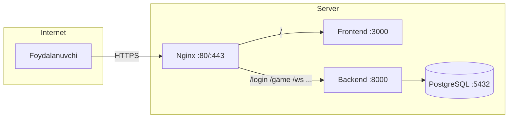

# Chess Nexus — Serverda Deploy Qilish

Bu qo'llanma **Chess Nexus** loyihasini VPS/serverga domain bilan deploy qilish va ishlab turgan loyihani yangilash bo'yicha to'liq ko'rsatma.

---

## Arxitektura



| Xizmat | Port | Vazifasi |
|--------|------|----------|
| Nginx | 80, 443 | Reverse proxy, SSL |
| Frontend | 3000 | React SPA (Docker) |
| Backend | 8000 | FastAPI |
| PostgreSQL | 5432 | Baza |

---

## Talablar

- Ubuntu 22.04 VPS (DigitalOcean, Linode, Hetzner va h.k.)
- Domen (A record server IP ga yo'naltirilgan)
- SSH kirish

---

## 1. Birinchi marta deploy

### 1.1 Serverga ulanish va asosiy o'rnatish

```bash
ssh root@YOUR_SERVER_IP
apt update && apt upgrade -y
apt install -y docker.io docker-compose nginx certbot python3-certbot-nginx
systemctl enable docker nginx
systemctl start docker nginx
```

### 1.2 Loyihani yuklash

```bash
mkdir -p /var/www
cd /var/www
git clone https://github.com/YOUR_USERNAME/shaxmat.git
cd shaxmat
```

Yoki `rsync` bilan:

```bash
rsync -avz --exclude node_modules --exclude venv --exclude .git ./ user@YOUR_SERVER_IP:/var/www/shaxmat/
```

### 1.3 Docker konteynerlarini ishga tushirish

```bash
cd /var/www/shaxmat
docker compose up -d --build
```

Konteynerlar holatini tekshirish:

```bash
docker compose ps
```

`db`, `backend`, `frontend` — barchasi `Up` bo'lishi kerak.

### 1.4 Baza jadvallarini yaratish (muhim)

Birinchi deploy da jadvallar bo'lmasa, ularni yaratish kerak:

```bash
docker compose exec backend python init_db.py
```

Tekshirish:

```bash
docker compose exec db psql -U shaxmat_user -d shaxmat_plus_db -c "\dt"
```

`users`, `games`, `moves`, `follows`, `friend_requests`, `notifications`, `board_states` ko'rinishi kerak.

### 1.5 Nginx sozlash

```bash
nano /etc/nginx/sites-available/chess-nexus
```

Quyidagini kiriting (domeningizni almashtiring):

```nginx
server {
    listen 80;
    server_name newchess.uz www.newchess.uz;

    # SPA: upstream (Docker frontend) index.html keshlanmasin — yangi JS hashlari ishlashi uchun
    location / {
        proxy_pass http://127.0.0.1:3000;
        proxy_http_version 1.1;
        proxy_set_header Host $host;
        proxy_set_header X-Real-IP $remote_addr;
        proxy_set_header X-Forwarded-For $proxy_add_x_forwarded_for;
        proxy_set_header X-Forwarded-Proto $scheme;
        proxy_buffering off;
    }

    location /game { proxy_pass http://127.0.0.1:8000; proxy_set_header Host $host; proxy_set_header X-Real-IP $remote_addr; proxy_set_header X-Forwarded-For $proxy_add_x_forwarded_for; proxy_set_header X-Forwarded-Proto $scheme; }
    location /signup { proxy_pass http://127.0.0.1:8000; proxy_set_header Host $host; proxy_set_header X-Real-IP $remote_addr; proxy_set_header X-Forwarded-For $proxy_add_x_forwarded_for; proxy_set_header X-Forwarded-Proto $scheme; }
    location /login { proxy_pass http://127.0.0.1:8000; proxy_set_header Host $host; proxy_set_header X-Real-IP $remote_addr; proxy_set_header X-Forwarded-For $proxy_add_x_forwarded_for; proxy_set_header X-Forwarded-Proto $scheme; }
    location /users { proxy_pass http://127.0.0.1:8000; proxy_set_header Host $host; proxy_set_header X-Real-IP $remote_addr; proxy_set_header X-Forwarded-For $proxy_add_x_forwarded_for; proxy_set_header X-Forwarded-Proto $scheme; }
    location /leaderboard { proxy_pass http://127.0.0.1:8000; proxy_set_header Host $host; proxy_set_header X-Real-IP $remote_addr; proxy_set_header X-Forwarded-For $proxy_add_x_forwarded_for; proxy_set_header X-Forwarded-Proto $scheme; }
    location /notifications { proxy_pass http://127.0.0.1:8000; proxy_set_header Host $host; proxy_set_header X-Real-IP $remote_addr; proxy_set_header X-Forwarded-For $proxy_add_x_forwarded_for; proxy_set_header X-Forwarded-Proto $scheme; }
    location /upload-avatar { proxy_pass http://127.0.0.1:8000; proxy_set_header Host $host; proxy_set_header X-Real-IP $remote_addr; proxy_set_header X-Forwarded-For $proxy_add_x_forwarded_for; proxy_set_header X-Forwarded-Proto $scheme; client_max_body_size 10M; }
    location /update-profile { proxy_pass http://127.0.0.1:8000; proxy_set_header Host $host; proxy_set_header X-Real-IP $remote_addr; proxy_set_header X-Forwarded-For $proxy_add_x_forwarded_for; proxy_set_header X-Forwarded-Proto $scheme; }
    location /uploads { proxy_pass http://127.0.0.1:8000; proxy_set_header Host $host; proxy_set_header X-Real-IP $remote_addr; proxy_set_header X-Forwarded-For $proxy_add_x_forwarded_for; proxy_set_header X-Forwarded-Proto $scheme; }

    location /ws {
        proxy_pass http://127.0.0.1:8000;
        proxy_http_version 1.1;
        proxy_set_header Upgrade $http_upgrade;
        proxy_set_header Connection "upgrade";
        proxy_set_header Host $host;
        proxy_set_header X-Real-IP $remote_addr;
        proxy_set_header X-Forwarded-For $proxy_add_x_forwarded_for;
        proxy_set_header X-Forwarded-Proto $scheme;
    }
}
```

Sahifani yoqish va nginxni qayta yuklash:

```bash
ln -sf /etc/nginx/sites-available/chess-nexus /etc/nginx/sites-enabled/
nginx -t
systemctl reload nginx
```

### 1.6 SSL (HTTPS)

```bash
certbot --nginx -d newchess.uz -d www.newchess.uz
```

### 1.7 Firewall

```bash
ufw allow 22
ufw allow 80
ufw allow 443
ufw enable
```

---

## 2. Ishlab turgan loyihani yangilash

Kod o'zgarganda yoki yangi versiya deploy qilishda:

### 2.1 Loyihani yangilash

```bash
cd /var/www/shaxmat
git pull origin main
```

Yoki `rsync` bilan:

```bash
rsync -avz --exclude node_modules --exclude venv --exclude .git ./ user@YOUR_SERVER_IP:/var/www/shaxmat/
```

### 2.2 Rebuild va qayta ishga tushirish

```bash
cd /var/www/shaxmat
docker compose down
docker compose up -d --build
```

### 2.3 Yangi jadval/migratsiya bo'lsa

Agar model o'zgargan bo'lsa:

```bash
docker compose exec backend python init_db.py
```

**Eslatma:** `init_db.py` mavjud jadvallarni o'chirmaydi, faqat yangi jadvallarni yaratadi.

---

## 3. Foydali buyruqlar

| Vazifa | Buyruq |
|--------|--------|
| Konteynerlar holati | `docker compose ps` |
| Loglar | `docker compose logs -f` |
| Faqat backend loglari | `docker compose logs backend -f --tail 50` |
| Barchasini qayta ishga tushirish | `docker compose restart` |
| Rebuild | `docker compose up -d --build` |
| To'xtatish | `docker compose down` |
| Baza bilan to'xtatish | `docker compose down -v` |

---

## 4. Baza tekshirish

### Foydalanuvchilar ro'yxati

```bash
docker compose exec db psql -U shaxmat_user -d shaxmat_plus_db -c "SELECT id, username, public_id FROM users;"
```

### Jadvallar ro'yxati

```bash
docker compose exec db psql -U shaxmat_user -d shaxmat_plus_db -c "\dt"
```

### Backend qaysi bazaga ulanganini tekshirish

```bash
docker compose exec backend env | grep DATABASE
```

Batafsil debug uchun: [DEBUG.md](DEBUG.md)

---

## 5. DNS sozlash

| Turi | Name | Qiymat |
|------|------|--------|
| A | @ | SERVER_IP |
| A | www | SERVER_IP |

---

## 6. Xavfsizlik

- [ ] `docker-compose.yml` da `shaxmat_password` ni kuchli parolga almashtiring
- [ ] HTTPS ishlatilayotganini tekshiring
- [ ] Server va Docker imajlarini muntazam yangilang

---

## 7. Muammolarni bartaraf etish

| Muammo | Yechim |
|--------|--------|
| 502 Bad Gateway | `docker compose ps` — backend ishlayaptimi? `docker compose logs backend` |
| Login ishlamaydi | [DEBUG.md](DEBUG.md) — baza jadvallari bormi? `init_db.py` ishlatildimi? |
| WebSocket ulanishi yo'q | Nginx `/ws` proxy to'g'ri sozlanganini tekshiring |
| Frontend yangilanmaydi | Quyidagi **tekshiruv** bo‘limiga qarang (build tugashi, `up -d`, `git pull`, CDN). |

---

### 7.1 Frontend yangilanmaydi — ketma-ket tekshiruv

1. **Kod serverda yangimi?** (eng ko‘p xato: eski kod bilan build)
   ```bash
   cd /var/www/shaxmat
   git fetch origin && git log -1 --oneline
   git status
   ```
   Kerak bo‘lsa: `git pull origin main` (yoki deploy qilinadigan branch).

2. **Build tugagan va konteyner yangi imageni ishlatayaptimi?**
   ```bash
   docker compose build --no-cache frontend
   docker compose up -d --force-recreate frontend
   docker compose ps
   ```
   `frontend` **Up** va yangi **IMAGE ID** bo‘lishi kerak.

3. **Konteyner ichida yangi `index.html` bormi?** (skript nomidagi hash o‘zgarishi kerak)
   ```bash
   docker compose exec frontend head -20 /usr/share/nginx/html/index.html
   ```

4. **Server o‘zi 3000-portda nima berayapti?**
   ```bash
   curl -sI http://127.0.0.1:3000/ | tr -d '\r'
   ```
   `Cache-Control` da `no-cache` / `no-store` bo‘lishi yaxshi (frontend nginx sozlamasiga qarab).

5. **Domen orqali Cloudflare** ishlatilsa: **Caching → Configuration → Purge Everything** (yoki faqat HTML) — bir marta.

6. **Brauzer**: qattiq yangilash (Ctrl+Shift+R) yoki inkognito oyna.
